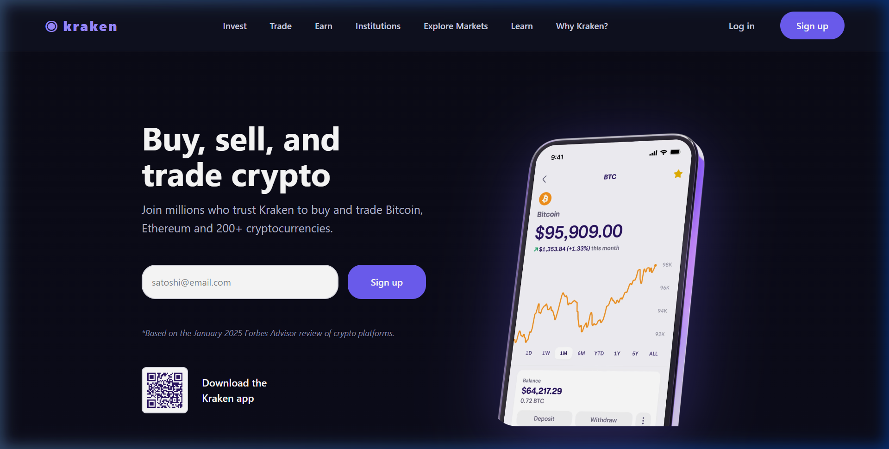
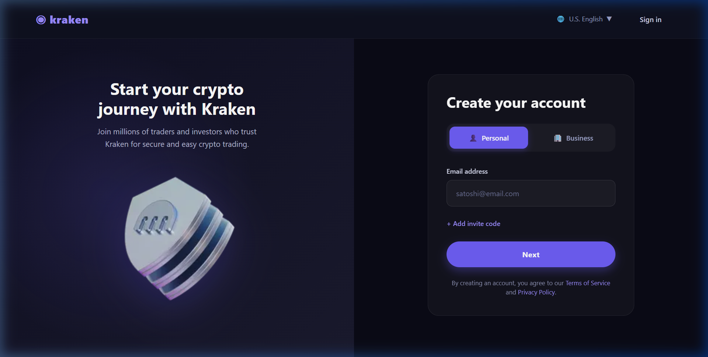
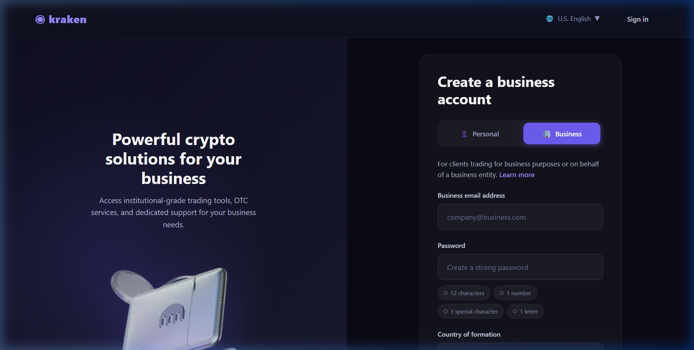

<p align="center">
  <span style="font-size:2rem">◉</span>
</p>

<h1 align="center">Kraken Clone</h1>

<p align="center">
  <em>A pixel-perfect frontend clone of the <a href="https://www.kraken.com">Kraken</a> cryptocurrency exchange — built with React, Vite & Tailwind CSS.</em>
</p>

<p align="center">
  
  
  
  
  
</p>

<p align="center">
  <a href="https://kraken-clone.vercel.app/">🌐 Live Demo</a>
</p>

---

## 📸 Screenshots

### Homepage


### Personal Signup


### Business Signup


---

## ✨ Features

| Feature | Description |
|---|---|
| 🏠 **Landing Page** | Hero section with animated mobile app demo video, email sign-up form, QR code download, and "Why Kraken?" feature cards |
| 👤 **Personal Signup** | Split-screen registration with crypto illustration, email input, invite code option, and legal agreements |
| 🏢 **Business Signup** | Institutional account creation with business email, password strength indicators, country selector, and corporate branding |
| 🧭 **Sticky Navbar** | Full navigation bar with links to Invest, Trade, Earn, Institutions, Explore Markets, Learn, and Why Kraken |
| 🦶 **Mega Footer** | 5-column footer with 50+ links organized across Features, Company, Browse Prices, Popular Markets, and Buying Guides |
| 📱 **Fully Responsive** | Optimized layouts for desktop, tablet, and mobile breakpoints |
| 🎨 **Dark Theme** | Authentic Kraken-purple dark mode design system with custom CSS variables |
| 🔍 **SEO Ready** | React Helmet for dynamic meta tags, `robots.txt`, `sitemap.xml`, and Google Search Console verification |
| ⚡ **Performance** | Vite-powered instant HMR, optimized WebP images, and tree-shaken builds |

---

## 🛠️ Tech Stack

| Layer | Technology |
|---|---|
| **Framework** | [React 19](https://react.dev/) with JSX |
| **Build Tool** | [Vite 8](https://vite.dev/) — lightning-fast HMR & builds |
| **Styling** | [Tailwind CSS 4](https://tailwindcss.com/) via `@tailwindcss/vite` plugin |
| **Routing** | [React Router DOM 7](https://reactrouter.com/) — client-side SPA routing |
| **SEO** | [React Helmet](https://github.com/nfl/react-helmet) — dynamic document head management |
| **Icons** | [React Icons](https://react-icons.github.io/react-icons/) |
| **Linting** | [ESLint 9](https://eslint.org/) with React Hooks & React Refresh plugins |
| **Deployment** | [Vercel](https://vercel.com/) |

---

## 📁 Project Structure

```
Kraken-clone/
├── public/
│   ├── favicon.svg              # Kraken-style SVG favicon
│   ├── icons.svg                # SVG icon sprite
│   ├── robots.txt               # Crawler rules (blocks /signup & /business)
│   ├── sitemap.xml              # XML sitemap for search engines
│   └── google35aea4216630d6d0.html  # Google Search Console verification
│
├── src/
│   ├── assets/                  # Static images & illustrations
│   │   ├── hero.png             # Homepage hero image
│   │   ├── download.png         # QR code for app download
│   │   ├── *.webp               # Optimized WebP images for feature cards
│   │   ├── react.svg            # React logo
│   │   └── vite.svg             # Vite logo
│   │
│   ├── components/              # Reusable UI components
│   │   ├── Navbar.jsx           # Sticky navigation bar with responsive menu
│   │   └── Footer.jsx           # 5-column mega footer with CTA section
│   │
│   ├── pages/                   # Route-level page components
│   │   ├── Home.jsx             # Landing page — hero, features, CTA
│   │   ├── Signup.jsx           # Personal account registration
│   │   └── Business.jsx         # Business account registration
│   │
│   ├── App.jsx                  # Root component — React Router config
│   ├── App.css                  # Legacy component styles
│   ├── index.css                # Global styles & Tailwind theme config
│   └── main.jsx                 # App entry point — React 19 createRoot
│
├── index.html                   # HTML shell — Vite entry point
├── vite.config.js               # Vite config — React + Tailwind plugins
├── eslint.config.js             # ESLint flat config
├── package.json                 # Dependencies & scripts
└── .gitignore                   # Git ignore rules
```

---

## 🚀 Getting Started

### Prerequisites

- **Node.js** ≥ 18.x
- **npm** ≥ 9.x (or yarn / pnpm)

### Installation

```bash
# 1. Clone the repository
git clone https://github.com/<your-username>/kraken-clone.git

# 2. Navigate into the project
cd kraken-clone

# 3. Install dependencies
npm install
```

### Development

```bash
# Start the dev server with hot module replacement
npm run dev
```

The app will be available at **`http://localhost:5173`**.

### Production Build

```bash
# Create an optimized production build
npm run build

# Preview the production build locally
npm run preview
```

### Linting

```bash
# Run ESLint across the project
npm run lint
```

---

## 🗺️ Routes

| Path | Page | Description |
|---|---|---|
| `/` | `Home.jsx` | Landing page with hero, feature cards, and CTA |
| `/signup` | `Signup.jsx` | Personal account creation (hides main Navbar) |
| `/business` | `Business.jsx` | Business/institutional account creation |

---

## 🎨 Design System

The project uses a custom **Kraken-inspired dark theme** configured through Tailwind CSS theme tokens in `index.css`:

| Token | Value | Usage |
|---|---|---|
| `--color-kraken-purple` | `#6e5ef6` | Primary brand color, buttons, CTAs |
| `--color-kraken-purple-hover` | `#5b4df0` | Button hover state |
| `--color-kraken-dark` | `#0f1120` | Navbar & card backgrounds |
| `--color-kraken-darker` | `#0b0b16` | Page background |
| `--color-kraken-text` | `#e6e6f0` | Primary text color |
| `--color-kraken-muted` | `#b3b7cd` | Secondary/muted text |
| `--color-kraken-border` | `rgba(255,255,255,0.06)` | Subtle dividers |
| `--color-kraken-purple-light` | `#9b8cff` | Logo & accent highlights |

---

## 📦 Available Scripts

| Script | Command | Description |
|---|---|---|
| `dev` | `npm run dev` | Start Vite dev server with HMR |
| `build` | `npm run build` | Create production-optimized bundle in `dist/` |
| `preview` | `npm run preview` | Serve the production build locally |
| `lint` | `npm run lint` | Run ESLint checks |

---

## 🌐 SEO Configuration

The project includes production-ready SEO configuration:

- **`robots.txt`** — Allows crawling of public pages, blocks `/signup` and `/business`
- **`sitemap.xml`** — Lists the homepage and business page with priority & frequency metadata
- **React Helmet** — Dynamically sets `<title>` and `<meta description>` per route
- **Google Search Console** — Verified via `google35aea4216630d6d0.html`

---

## 🚢 Deployment

The project is deployed on **Vercel** and accessible at:

🔗 **[https://kraken-clone.vercel.app/](https://kraken-clone.vercel.app/)**

To deploy your own instance:

1. Push the repository to GitHub
2. Import the project on [Vercel](https://vercel.com/new)
3. Vercel auto-detects Vite — no additional configuration required
4. Deploy 🚀

---

## 📄 License

This project is open source and available under the [MIT License](LICENSE).

---

## ⚠️ Disclaimer

> This project is a **frontend UI clone** built for **educational and portfolio purposes only**. It is not affiliated with, endorsed by, or connected to [Kraken](https://www.kraken.com) or Payward, Inc. in any way. No real trading, authentication, or financial functionality is implemented. All trademarks belong to their respective owners.

---

<p align="center">
  Built with 💜 using React + Vite + Tailwind CSS
</p>